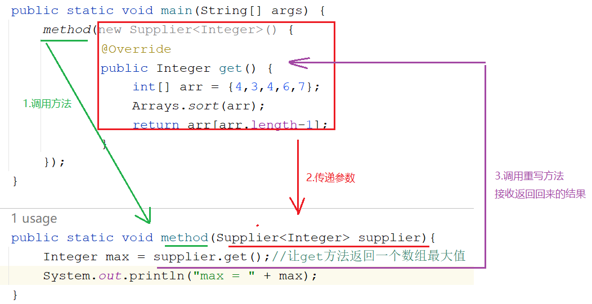
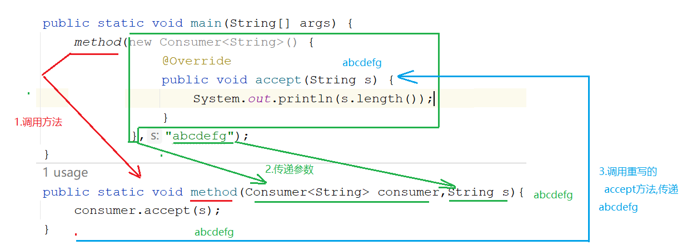
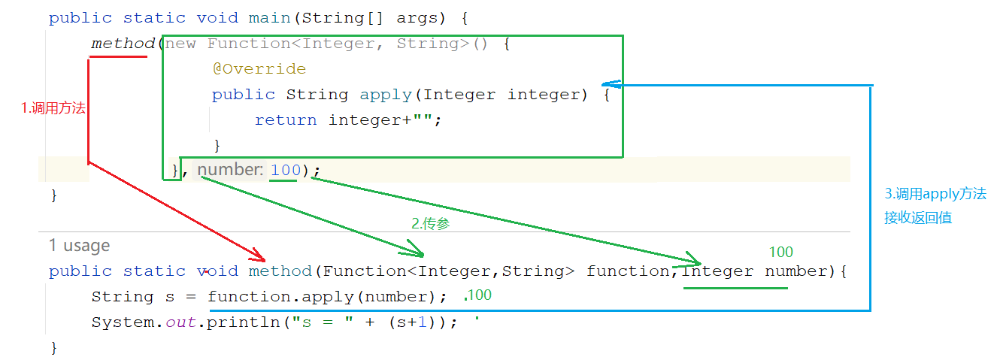

# 函数式接口介绍

## 定义：

**接口中有且仅有一个抽象方法称为函数式接口，在函数式接口中只能存在一个抽象方法，但可以正常创建其他除抽象方法以外的方法如：静态方法、默认方法等**

## jdk提供的函数式接口：
> Supplier
> 
> Consumer
> 
> Function
> 
> Predicate
## Supplier

```java
1.Supplier接口
   java.util.function.Supplier<T>接口，它意味着"供给"->我们想要什么就给什么
2.方法:
  T get() -> 我们想要什么,get方法就可以返回什么

3.需求:
   使用Supplier接口作为方法的参数
   用Lambda表达式求出int数组中的最大值
       
4.泛型:
  <引用数据类型>-> 规定了我们操作的数据是什么类型
  <>中只能写引用数据类型,不能写基本数据类型
```

| 基本类型 | 包装类    |
| -------- | --------- |
| byte     | Byte      |
| short    | Short     |
| int      | Integer   |
| long     | Long      |
| float    | Float     |
| double   | Double    |
| char     | Character |
| boolean  | Boolean   |



## Consumer

```java
java.util.function.Consumer<T>->消费型接口->操作
  方法:
    void accept(T t)，意为消费一个指定泛型的数据
        
"消费"就是"操作",至于怎么操作,就看重写accept方法之后,方法体怎么写了
```

```java
public class Demo02Consumer {
    public static void main(String[] args) {
        method(new Consumer<String>() {
            @Override
            public void accept(String s) {
                System.out.println(s.length());
            }
        },"abcdefg");
        System.out.println("==================");
        method(s-> System.out.println(s.length()),"abcdefg");
    }
    public static void method(Consumer<String> consumer,String s){
        consumer.accept(s);
    }
}
```


## 3.Function

```java
java.util.function.Function<T,R>接口用来根据一个类型的数据得到另一个类型的数据
  方法:
     R apply(T t)根据类型T参数获取类型R的结果
```

```java
public class Demo03Function {
    public static void main(String[] args) {
        method(new Function<Integer, String>() {
            @Override
            public String apply(Integer integer) {
                return integer+"";
            }
        },100);

        System.out.println("===================");
        method(integer -> integer+"",200);
    }

    public static void method(Function<Integer,String> function,Integer number){
        String s = function.apply(number);
        System.out.println("s = " + (s+1));
    }
}

```


## 4.Predicate

```java
java.util.function.Predicate<T>接口。->判断型接口
    boolean test(T t)->用于判断的方法,返回值为boolean型
```

```java
public class Demo04Predicate {
    public static void main(String[] args) {
        method(new Predicate<String>() {
            @Override
            public boolean test(String s) {
                return s.length()==7;
            }
        },"abcdefg");

        System.out.println("===================");

        method(s -> s.length()==7,"abcd");
    }
    public static void method(Predicate<String> predicate,String s){
        boolean test = predicate.test(s);
        System.out.println("test = " + test);
    }
}
```