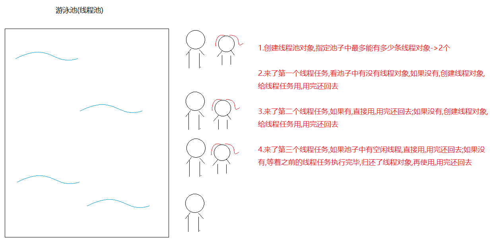

# 线程池



```java
1.问题:之前来一个线程任务,就需要创建一个线程对象去执行,用完还要销毁线程对象,如果线程任务多了,就需要频繁创建线程对象和销毁线程对象,这样会耗费内存资源,所以我们就想线程对象能不能循环利用,用的时候直接拿线程对象,用完还回去
```

```java
1.如何创建线程池对象:用具类-> Executors
2.获取线程池对象:Executors中的静态方法:
  static ExecutorService newFixedThreadPool(int nThreads)  
  a.参数:指定线程池中最多创建的线程对象条数
  b.返回值ExecutorService 是线程池,用来管理线程对象
      
3.执行线程任务: ExecutorService中的方法
  Future<?> submit(Runnable task) 提交一个Runnable任务用于执行 
  Future<T> submit(Callable<T> task) 提交一个Callable任务用于执行 
    
4.submit方法的返回值:Future接口
  用于接收run方法或者call方法返回值的,但是run方法没有返回值,所以可以不用Future接收,执行call方法需要用Future接收
    
  Future中有一个方法:V get()  用于获取call方法返回值
    
5. ExecutorService中的方法:
   void shutdown()  启动有序关闭，其中先前提交的任务将被执行，但不会接受任何新任务
```